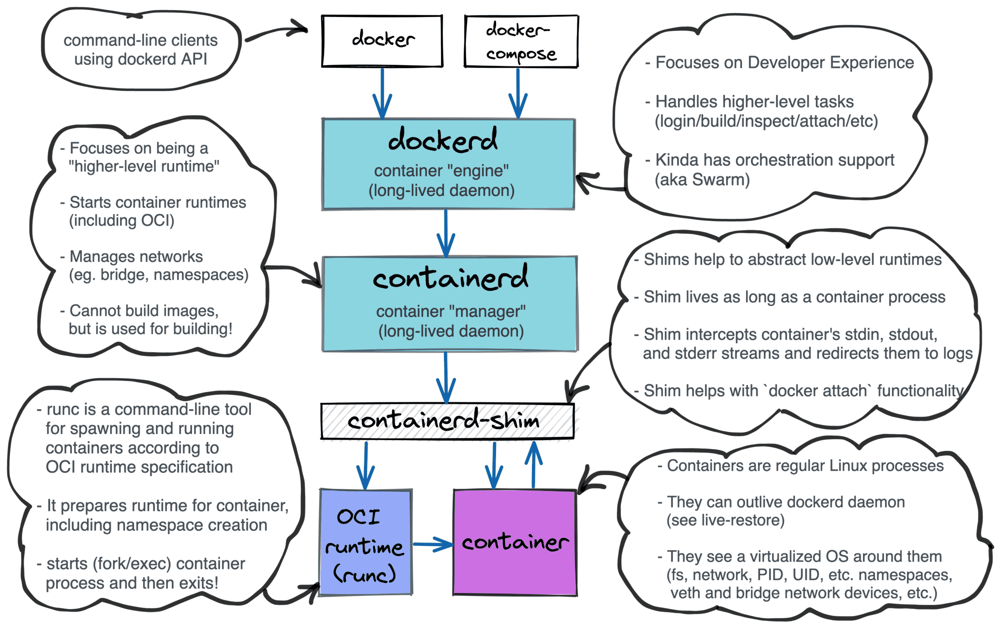

# Container Internals

- What even is _docker_?

- cgroups

- namespaces

- image layers? union filesystems?

---

# An Example

What components are involved in making `docker run` work?

```bash
docker run --rm alpine:latest echo Hello!
```

- Docker CLI

- Docker Daemon

- `containerd`: Managing `runc`, Pushing & Pulling images to/from the Container registry, ...

- `runc`: Actually runs the "container" by setting up cgroups, namespaces, [PTYs](https://github.com/opencontainers/runc/blob/main/docs/terminals.md), etc.



---

# Digging Deeper

So, what exactly is isolated from the "host" in the container?

`docker run --rm -it alpine:latest`

- Rootfs (duh)

- PIDs

```bash
/ # echo $$
1
/ # ps -A
PID   USER     TIME  COMMAND
    1 root      0:00 /bin/sh
    7 root      0:00 ps -A
```

- Pseudo-Filesystems (/dev, /proc, etc.)

```bash
/ # ls /dev
console  full     null     pts      shm      stdin    tty      zero
fd       mqueue   ptmx     random   stderr   stdout   urandom
```

```bash
/ # ls /proc
1             cmdline       dma           iomem         kpagecgroup   modules       slabinfo      timer_list
15            config.gz     driver        ioports       kpagecount    mounts        softirqs      tty
acpi          consoles      execdomains   irq           kpageflags    mtrr          stat          uptime
asound        cpuinfo       fb            kallsyms      loadavg       net           swaps         version
buddyinfo     crypto        filesystems   key-users     locks         pagetypeinfo  sys           vmallocinfo
bus           devices       fs            keys          meminfo       partitions    sysvipc       vmstat
cgroups       diskstats     interrupts    kmsg          misc          self          thread-self   zoneinfo
```

---

- Network

```bash
/ # ip a
1: lo: <LOOPBACK,UP,LOWER_UP> mtu 65536 qdisc noqueue state UNKNOWN qlen 1000
    link/loopback 00:00:00:00:00:00 brd 00:00:00:00:00:00
    inet 127.0.0.1/8 scope host lo
       valid_lft forever preferred_lft forever
2: ip_vti0@NONE: <NOARP> mtu 1480 qdisc noop state DOWN qlen 1000
    link/ipip 0.0.0.0 brd 0.0.0.0
3: sit0@NONE: <NOARP> mtu 1480 qdisc noop state DOWN qlen 1000
    link/sit 0.0.0.0 brd 0.0.0.0
33: eth0@if34: <BROADCAST,MULTICAST,UP,LOWER_UP,M-DOWN> mtu 1500 qdisc noqueue state UP 
    link/ether 02:42:ac:11:00:02 brd ff:ff:ff:ff:ff:ff
    inet 172.17.0.2/16 brd 172.17.255.255 scope global eth0
       valid_lft forever preferred_lft forever
```

---

# Reinventing It!

We could use the `unshare` command to do, well, basically everything that's going to be described in the slides, but we'll be writing some code for better understanding: [code](toy-demo/src)

Now, with this code, we have a semi-isolated process running, with it's own PID and Network namespaces

```bash
$ ps -A
PID   USER     TIME  COMMAND
    1 65534     0:00 sh
    2 65534     0:00 ps -A
$ ls /proc
1             devices       kallsyms      mounts        thread-self
3             diskstats     key-users     mtrr          timer_list
acpi          dma           keys          net           tty
asound        driver        kmsg          pagetypeinfo  uptime
buddyinfo     execdomains   kpagecgroup   partitions    version
bus           fb            kpagecount    self          vmallocinfo
cgroups       filesystems   kpageflags    slabinfo      vmstat
cmdline       fs            loadavg       softirqs      zoneinfo
config.gz     interrupts    locks         stat
consoles      iomem         meminfo       swaps
cpuinfo       ioports       misc          sys
crypto        irq           modules       sysvipc
```

```bash
$ ip a
1: lo: <LOOPBACK> mtu 65536 qdisc noop state DOWN group default qlen 1000
    link/loopback 00:00:00:00:00:00 brd 00:00:00:00:00:00
2: ip_vti0@NONE: <NOARP> mtu 1480 qdisc noop state DOWN group default qlen 1000
    link/ipip 0.0.0.0 brd 0.0.0.0
3: sit0@NONE: <NOARP> mtu 1480 qdisc noop state DOWN group default qlen 1000
    link/sit 0.0.0.0 brd 0.0.0.0
$ curl https://duckduckgo.com
curl: (6) Could not resolve host: duckduckgo.com
```

---

That was a fine toy example, but we would like something more... usable. For starters, let's make ourselves root inside the namespace, which would be needed to say, install packages in a container, bind to a privileged port, etc.

For this, user namespaces allow us to create UID and GID mappings, wherein a proxy UID/GID inside the container can have privileges equal to a UID/GID on the host:

- `/proc/<pid>/uid_map`

- `/proc/<pid>/gid_map`

[code](toy-demo/src)

---

- https://iximiuz.com/en/posts/implementing-container-runtime-shim
